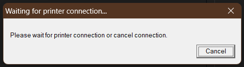

# PDF Merger Tool

Note: The tool is in an incomplete state. Use caution when using the tool, and expect that some features will not work correctly or at all.

# Description

This tool is designed to collect source code and Gradle reports (test and checkstyle) from any Java project that uses Gradle as its build system, and combine it into a PDF file. You can also configure it to combine source code into a PDF from other projects. With command-line options, you can grab only the reports that you need or add additional PDFs to the output PDF. For instance, if you just need to make a PDF with the source code of a non-Gradle Java project, you can.


# Requirements

To use this tool, you'll need to install Python and some pip packages. This is tested with the following versions:
* [Python 3.12.3](https://www.python.org/downloads/)
* [wkhtmltopdf 0.12.6](https://wkhtmltopdf.org/downloads.html) (the portable zip works if you don't want to install it on Windows)
* pdfkit 1.0.0
* PyPDF2 3.0.1
* fpdf 1.7.2

## Installing wkhtmltopdf

Download wkhtmltopdf from the link above. You can either download the installer or the portable zip version (if using Windows). If you opt for the portable zip version, extract the contents and copy the executable (wkhtmltopdf.exe) to the same folder as `run.py`.

## Installing pip packages
To install the required pip packages, install Python then run this command (don't forget to restart any terminal windows after installing Python):
```
pip install pdfkit==1.0.0 pypdf2==3.0.1 fpdf==1.7.2
```

# Usage


# Troubleshooting

If you're on Windows and run into an issue where you get this popup (waiting for printer connection)...



You can click Cancel to continue, or, if your project has a lot of Gradle reports that the tool is aggregating, go into your system settings and change your default printer to "Microsoft Print to PDF." This should prevent the popup from appearing.
